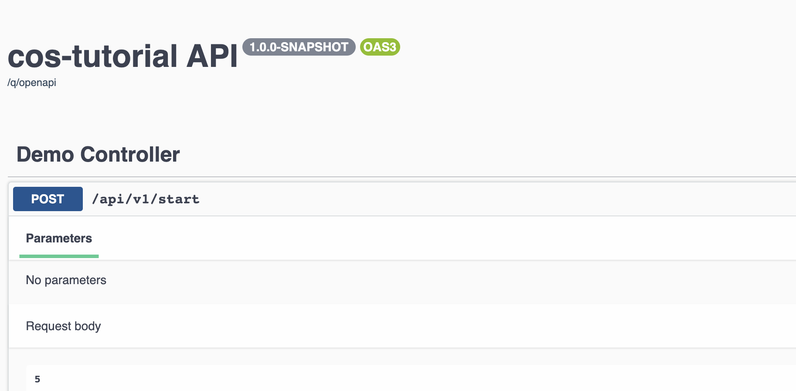
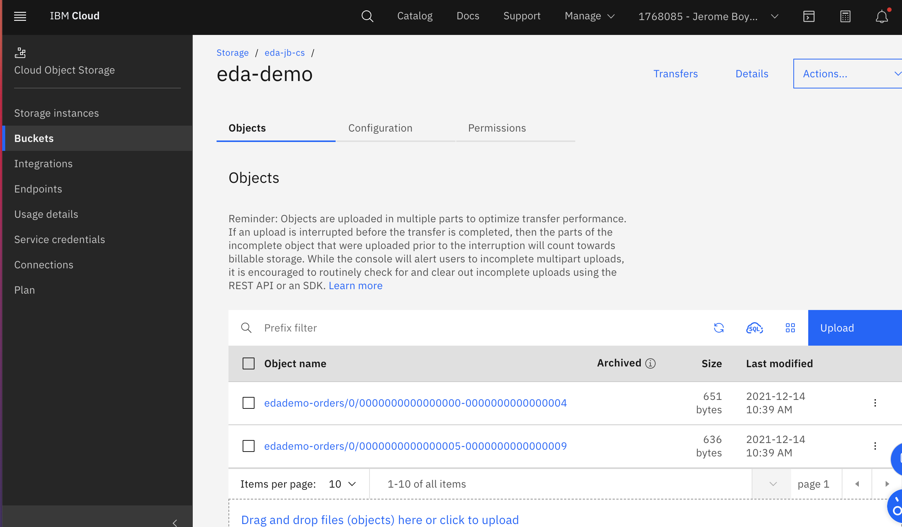

# Cloud Object Storage Sink tutorial Project

The Java Quarkus app is a generator for order events with a simple PLAINTEXT connection to
IBM Event Streams to be source of Cloud Object Storage.

## Development history

The project was created with the quarkus CLI:

```sh
quarkus create app cos-tutorial 
cd cos-tutorial
quarkus ext add  reactive-messaging-kafka, mutiny, openshift
```

Then `DemoController.java` exposes two end points and use reactive messaging to produce
random Order in a light version of a TLOG. It is wrapped into a [CloudEvent](https://cloudevents.io/)
using Quarkus reactive messaging.

For OpenShift deployment the configuration is controlled via configuration map, and kustomize.

## Run locally

For development purpose you can run with Quarkus dev, which will start a local Kafka (RedPanda):

```sh
quarkus dev
```

* Go to the swagger UI http://localhost:8080/q/swagger-ui to start the demo and use the `/api/v1/start` API:



* Verify the generated message in the kafka topic:

```sh
docker exect -ti kafka bash
$ cd /opt/kafka/bin
$ ./kafka-console-consumer.sh --bootstrap-server localhost:9092 --topic edademo-orders --from-beginning
```

## End to end demo

We have done a docker compose to demonstrate on your laptop this demonstration,
As a pre-requisite you need an IBM Cloud Object Storage service provisioned. See the
[Create an IBM COS Service and COS Bucket article](https://ibm-cloud-architecture.github.io/refarch-eda/use-cases/connect-cos/#create-an-ibm-cos-service-and-cos-bucket).

Be sure to have docker daemon running and docker compose. 

* Modify the file `kustomize/services/kconnect/local/kafka-cos-sink-standalone.properties`
with the properties to connect to cloud object storage

```
cos.api.key=IBM_COS_API_KEY
cos.bucket.location=IBM_COS_BUCKET_LOCATION
cos.bucket.name=IBM_COS_BUCKET_NAME
cos.bucket.resiliency=IBM_COS_RESILIENCY
cos.service.crn="crn:IBM_COS_CRM"
```

* Start the environment

```sh
docker compose up &
```

* Start to send some TLOG orders

```sh
curl -X 'POST' \
  'http://localhost:8080/api/v1/start' \
  -H 'accept: application/json' \
  -H 'Content-Type: application/json' \
  -d '10'
```

* Go to the Cloud Object Storage user interface and the `eda-demo`, you should see new record added.



You can download those records or use SQL query to access them.

* Stop everything:

```sh
docker compose down
```

## Deploy on OpenShift

As a pre-requisite you need one instance of Event Streams. The kustomize folder includes
the simplest event streams cluster needed. 

* Create an OpenShift project (k8s namespace) named: eda-cos

  ```sh
  oc apply -k kustomize/env/base
  ```

* Define your [entitlement key]() for this project.

```sh
oc create secret docker-registry ibm-entitlement-key \
    --docker-username=cp \
    --docker-password=$key \
    --docker-server=cp.icr.io \
    --namespace=eda-cos
```

* Deploy Event Streams Cluster.
 
 ```sh
 oc apply -k kustomize/services/es 
 # --> Results
 eventstreams.eventstreams.ibm.com/dev created
 kafkatopic.eventstreams.ibm.com/edademo-orders created
 ```

It will take sometime to get the cluster created. Monitor with `oc get pod -w`. You should
get:

```
dev-entity-operator-6d7d94f68f-6lk86   3/3    
dev-ibm-es-admapi-ffd89fdf-x99lq       1/1    
dev-ibm-es-ui-74bf84dc67-qx9kk         2/2    
dev-kafka-0                            1/1    
dev-zookeeper-0                        1/1
```

With this deployment there is no external route, only on bootstrap URL: `dev-kafka-bootstrap.eda-cos.svc:9092`

* Deploy the application using:

```sh
oc apply -k kustomize/apps/eda-cos-demo/base/
```

* During the application development we can do continuously deployment with:

```sh
./mvnw package -Dquarkus.container-image.build=true -Dquarkus.kubernetes.deploy=true
```

 Then get the routes for the `eda-code-demo` and use the swagger ui to start the demo.

When adopting Gitops approach you can: 

   * Build the image and push it to quay.io: `scripts/buildAdd.sh`. Update the image name to use your own registry.
   * The service, configmap, event stream topic, and app deployment resources are created, which means
   this `kustomize/apps` folder could be copied in a GitOps folder created by kam.

## Deploy Kafka connect

We have already build a kafka connect image with the Cloud Object Storage jar so normally
to deploy to the `eda-cos` we need to just do:

```sh
oc apply -f kustomize/services/kconnect/kafka-connect.yaml
# Verify cluster is ready
oc get kafkaconnect
```

## Deploy the cos sink connector

Modify the kafka-cos-sink-connector.yaml with your Cloud Object Storage credential, URL, bucket...

then deploy the connector:

```sh
oc apply -f kustomize/services/kconnect/kafka-cos-sink-connector.yaml
```

### For the maintainer of this tutorial

Here are the needed steps as of 12/10/2021.

```sh
# clone source 
git clone https://github.com/ibm-messaging/kafka-connect-ibmcos-sink
cd kafka-connect-ibmcos-sink
# Be sure to be on java 11 or 8 to avoid a class version exception
sdk list java
sdk use  java 8.0.292.j9-adpt 
gradle shadowJar
# mv create jars to plugin
mv build/libs/kafka-connect-ibmcos-sink-1.0.0-all.jar kustomize/services/kconnect/my-plugins
# Build the docker image
docker build -t quay.io/ibmcase/eda-cos-kconnect-cluster-image .
docker push quay.io/ibmcase/eda-cos-kconnect-cluster-image
```
