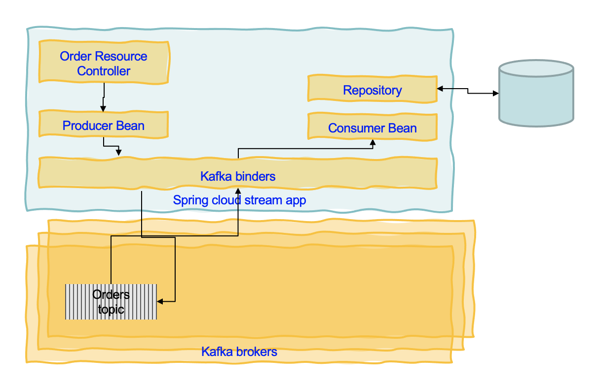
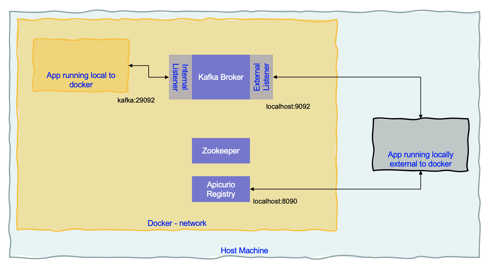

# Starter code for Kafka app using Spring Cloud Stream

This application provides the boiler plate for a event-driven microservice that support CRUD operation on a business entity (Order) and uses Kafka to share information about the order.


## Code explanation

The Application class declares a Spring boot application, and a bean which is supported by a java function and will act as a consumer of OrderEvents message coming from the input binding. The code uses the Spring Cloud Stream APIs. 

The Controller is using a service to support the business logic. The service processes the message and sends it a topic via Kafka binders. The following figure illustrates the flow: the API exposes a POST operation for new order to come, the service is the producer bean and send the message directly to Kafka. 



Then the message is consumed and processed by the repository bean that will persist the data to its external datasource.


The way to generate code from a POST or an internal processing is to use [StreamBridge](https://github.com/spring-cloud/spring-cloud-stream/blob/master/spring-cloud-stream/src/main/java/org/springframework/cloud/stream/function/StreamBridge.java), which exposes a send function to send the record.

```java
    @Autowired
	private StreamBridge streamBridge;

    public Order processANewOrder(Order order) {
        order.status = OrderStatus.OPEN;
        order.orderID = UUID.randomUUID().toString();
        order.creationDate = LocalDate.now();
        Message<Order> toSend = MessageBuilder.withPayload(order)
            .setHeader(KafkaHeaders.MESSAGE_KEY, order.customerID.getBytes())
            .setHeader(MessageHeaders.CONTENT_TYPE, MimeTypeUtils.APPLICATION_JSON).build();
        streamBridge.send(BINDING_NAME, toSend);
        return order;
    }
```

## Build and run locally

The following figure illustrates the current docker compose environment with Kafka, Zookeeper and Apicurio:



For external to docker network connection we will use localhost:9092, and any other internal to docker network app will use `kafka:29092` connection. The docker compose for the kafka container configure the internal and external listerner as:

```
KAFKA_ADVERTISED_LISTENERS: INTERNAL://kafka:29092,EXTERNAL://localhost:9092
KAFKA_LISTENER_SECURITY_PROTOCOL_MAP: INTERNAL:PLAINTEXT,EXTERNAL:PLAINTEXT
KAFKA_LISTENERS: EXTERNAL://0.0.0.0:9092,INTERNAL://kafka:29092
KAFKA_ZOOKEEPER_CONNECT: zookeeper:2181
KAFKA_INTER_BROKER_LISTENER_NAME: INTERNAL
```

* Use environment variables declared in a `.env` file to specify the following:

```properties
KAFKA_BOOTSTRAP_SERVERS=localhost:9092
```

* Then build with `./mvnw clean package`
* Start Kafka, Zookeeper, Apicurio and Kafdrop locally with: `docker-compose up -d`
* Create the needed topics: `./scripts/createTopics.sh`
* Run the app with:

```shell
java -jar target/spring-cloud-stream-0.0.1.jar
```

Do integration smoke test with: `./e2e/postOrders.sh` which should post five new orders to the `/orders` API, which should generate events to the `orders` topic. As the record includes a key based on the customerID, each records with the same key will go to the same partition:


Kafdrop is started with docker compose, and accessible to the URL: [http://localhost:9000/](http://localhost:9000/)
## Deploy to OpenShift

